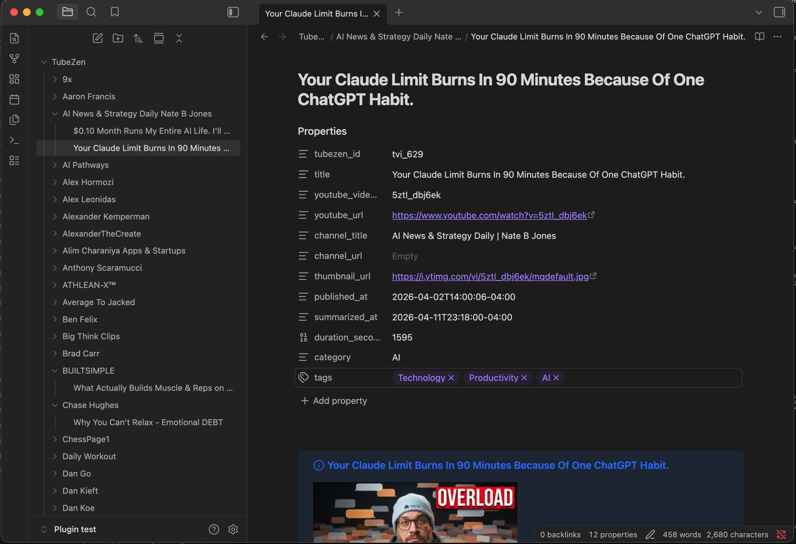
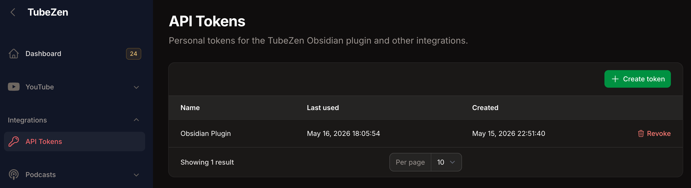
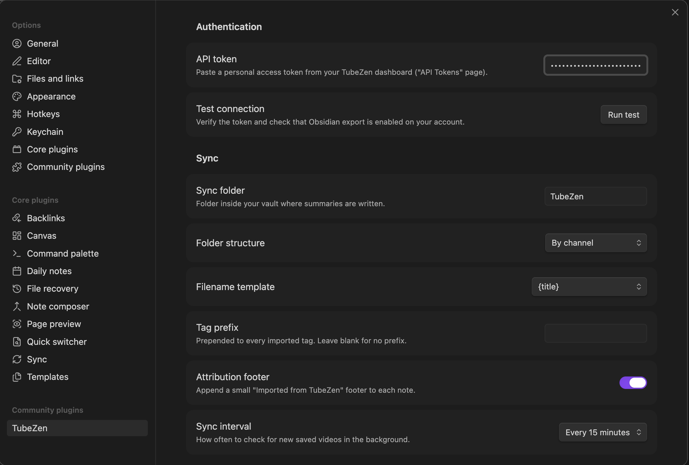
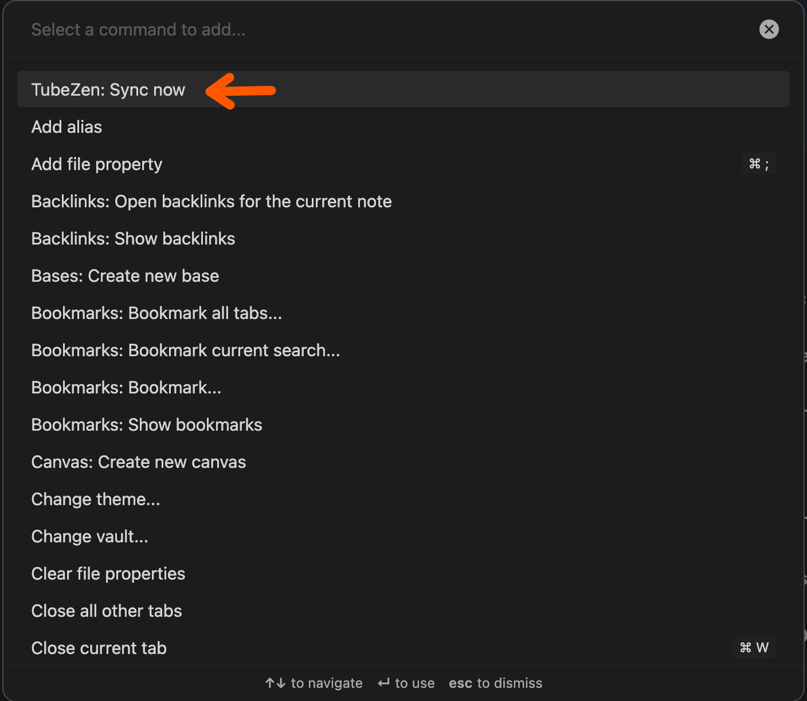

# TubeZen for Obsidian

Import YouTube and podcast summaries from [TubeZen](https://tubezen.ai) into your Obsidian vault. Each saved item becomes a note with full frontmatter, a callout header, and the summary body — ready to link, tag, and reference like any other note.



## Features

- **One-way sync** of YouTube and podcast summaries you've explicitly marked as saved for export.
- **Idempotent** — re-running sync only fetches new items; existing notes are left alone unless explicitly re-imported.
- **Independent cursors per content type** — videos and podcasts sync in separate passes with their own pagination state.
- **Four folder organizations**: flat, by channel, by date, or by saved category tag.
- **Three filename templates**: title, date + title, channel + title.
- **Background sync** at 15-minute / 1-hour / 6-hour intervals, or fully manual.
- **Mobile + desktop.**

## Requirements

- Obsidian **1.5.0** or later
- A [TubeZen](https://tubezen.ai) account — the plugin is free on every plan, including the free tier. Importing raw **transcripts** alongside the summaries needs a subscription that includes transcript access; everything else works without one.
- A personal access token generated from your TubeZen dashboard

## Platform support

Works on **desktop and mobile** (iOS and Android). All vault writes go through Obsidian's cross-platform vault API and HTTP requests use Obsidian's `requestUrl`, so there are no Node.js or Electron dependencies.

One caveat on mobile: the background sync interval only ticks while Obsidian is in the foreground. iOS in particular suspends backgrounded apps aggressively, so an "Every 15 minutes" setting effectively means "every 15 minutes that the app is open." Manual sync from the command palette works the same on all platforms.

## Installation

### From the community plugins directory

In Obsidian: Settings → Community plugins → Browse → search "TubeZen" → Install → Enable.

### Manual install

1. Download `main.js`, `manifest.json`, and `styles.css` from the latest [release](https://github.com/surefirejack/obsidian-tubezen/releases).
2. Create a folder named `tubezen/` inside `<your-vault>/.obsidian/plugins/`.
3. Drop the three files into that folder.
4. In Obsidian: Settings → Community plugins → Reload plugins, then toggle **TubeZen** on.

## Setup

1. Open Settings → TubeZen.
2. In your [TubeZen dashboard](https://tubezen.ai), open the API Tokens page, generate a new token, copy it.

   

3. Paste the token into the **API token** field.
4. Click **Run test** under "Test connection". You should see your account info and `Obsidian export: enabled`.

   

5. Pick a folder organization, filename template, and sync interval.
6. Open the command palette (Cmd/Ctrl + P) and run **TubeZen: Sync now**.

## Settings reference

| Setting | What it does |
|---|---|
| **API token** | Bearer token from your TubeZen dashboard. Stored locally in the plugin's data file. |
| **Test connection** | Calls `/me` and reports your user, workspace, plan, and whether Obsidian export is active. |
| **Sync videos** | Include YouTube video summaries in sync. On by default. |
| **Sync podcasts** | Include podcast episode summaries in sync. On by default. |
| **Sync folder** | Vault folder where summaries are written. Default `TubeZen`. |
| **Folder structure** | `Flat` / `By channel` / `By date (year/month)` / `By tag`. "By tag" uses your saved category, with `_uncategorized/` as the fallback for untagged items. |
| **Filename template** | `{title}` / `{published_date} - {title}` / `{channel} - {title}`. |
| **Tag prefix** | Prepended to every imported tag. Default is empty — tags pass through raw. |
| **Attribution footer** | Appends an "Imported from TubeZen" line to each note. |
| **Sync interval** | `Off` (manual only) / 15 minutes / 1 hour / 6 hours. |

### Advanced settings

| Setting | What it does |
|---|---|
| **API base URL** | Defaults to `https://tubezen.ai/api/v1`. Change only for self-hosted or staging environments. |
| **Reset sync cursors** | Clears the saved pagination cursors for both videos and podcasts so the next sync scans each stream from the beginning. To fully re-import after a backend change, also delete the existing notes from your vault before syncing. |

## Commands



| Command | When available | What it does |
|---|---|---|
| **TubeZen: Sync now** | Always | Fetches saved summaries since the last cursor position. |
| **TubeZen: Re-import this summary** | When the active note has a `tubezen_id` in frontmatter | Refetches and **overwrites** the active note with the latest version from TubeZen. |
| **TubeZen: Open original on YouTube** | When the active note has `youtube_url` or `youtube_video_id` in frontmatter | Opens the source video in your default browser. |

> **Re-import is destructive.** Any manual edits below the summary are wiped. Obsidian's Cmd/Ctrl+Z does not undo plugin file modifications.

## Note format

All notes share the same YAML frontmatter shape — type-specific fields are populated for the matching content type and `null` otherwise — which keeps Dataview queries simple.

### YouTube video note

````markdown
---
tubezen_id: "tvi_42"
content_type: "youtube"
title: "How to Build a Plugin"
youtube_video_id: "abc123"
youtube_url: "https://youtube.com/watch?v=abc123"
taddy_uuid: null
audio_url: null
season_number: null
episode_number: null
channel_title: "Fireship"
channel_url: "https://youtube.com/@fireship"
thumbnail_url: "https://i.ytimg.com/vi/abc123/hqdefault.jpg"
published_at: "2026-05-01T12:00:00Z"
summarized_at: "2026-05-10T08:30:00Z"
duration_seconds: 420
category: "Tutorials"
tags:
  - "react"
  - "tutorial"
---

> [!info] How to Build a Plugin
> 
>
> **Channel:** [[Fireship]]
> **Published:** 2026-05-01
> **Duration:** 7m
> **Watch:** [YouTube](https://youtube.com/watch?v=abc123)

## Summary

<summary content from TubeZen>

---

*Imported from [TubeZen](https://tubezen.ai) on 2026-05-16.*
````

### Podcast episode note

````markdown
---
tubezen_id: "tpe_17"
content_type: "podcast"
title: "Why Distributed Systems Are Hard"
youtube_video_id: null
youtube_url: null
taddy_uuid: "abc-123-uuid"
audio_url: "https://example.com/episodes/17.mp3"
season_number: 2
episode_number: 14
channel_title: "Software Engineering Daily"
channel_url: "https://softwareengineeringdaily.com"
thumbnail_url: "https://example.com/podcast-art.jpg"
published_at: "2026-05-03T09:00:00Z"
summarized_at: "2026-05-12T11:15:00Z"
duration_seconds: 2820
category: "Systems"
tags:
  - "distributed-systems"
  - "interview"
---

> [!info] Why Distributed Systems Are Hard
> 
>
> **Channel:** [[Software Engineering Daily]]
> **Published:** 2026-05-03
> **Duration:** 47m
> **Season 2 · Episode 14**
> **Listen:** [Audio](https://example.com/episodes/17.mp3)

## Summary

<summary content from TubeZen>

---

*Imported from [TubeZen](https://tubezen.ai) on 2026-05-16.*
````

The `tubezen_id` frontmatter field is the dedup anchor — `tvi_…` for YouTube and `tpe_…` for podcasts, never collide. On every sync the plugin scans the vault for existing notes carrying this id and skips anything already imported.

## Privacy & data handling

- **Your API token is stored as plain text** in `<your-vault>/.obsidian/plugins/tubezen/data.json`. Obsidian doesn't expose a cross-platform secure-storage API, so this is consistent with other API-based community plugins. Treat your `.obsidian/plugins/tubezen/` folder accordingly.
- **No analytics, no telemetry.** The plugin makes network requests only to your configured TubeZen base URL, and only when triggered by you (manual sync, test connection, re-import) or by the configured background interval.
- **No third-party services.** The plugin does not phone home to any URL except your TubeZen instance.

## Network endpoints

The plugin uses Obsidian's `requestUrl` API (mobile-safe) and hits only these endpoints on your configured TubeZen host:

| Method | Endpoint | When |
|---|---|---|
| `GET` | `/api/v1/me` | When you click "Test connection" |
| `GET` | `/api/v1/exports/saved?type=video&cursor=…&limit=50` | Every sync, once for `type=video` and once for `type=podcast` based on your enabled sync types, paginated until each stream ends |
| `GET` | `/api/v1/exports/{tubezen_id}` | When you run "Re-import this summary"; `tubezen_id` is the full prefixed string from frontmatter (`tvi_…` or `tpe_…`) |

All requests include `Authorization: Bearer <your-token>`.

## Development

```bash
npm install
npm run dev        # watch mode, rebuilds main.js on save
npm run build      # production build (typecheck + minify)
npm run typecheck
```

To develop against a real vault, symlink the build artifacts into a test vault's plugins folder:

```bash
mkdir -p "<vault>/.obsidian/plugins/tubezen"
ln -sf "$(pwd)/main.js"       "<vault>/.obsidian/plugins/tubezen/main.js"
ln -sf "$(pwd)/manifest.json" "<vault>/.obsidian/plugins/tubezen/manifest.json"
ln -sf "$(pwd)/styles.css"    "<vault>/.obsidian/plugins/tubezen/styles.css"
```

Toggle the plugin off and on in Community plugins to reload after each rebuild, or install [Hot Reload](https://github.com/pjeby/hot-reload) and create an empty `.hotreload` file in the plugin folder for automatic reloads.

## Roadmap

Deferred from v1, intentionally scoped out:

- Structured key takeaways with timestamps (pending backend support)
- Two-way sync / creating summaries from Obsidian
- Custom filename / folder template editor (beyond the three preset combinations)
- OAuth device flow (paste-token is the v1 auth UX)

## License

[MIT](./LICENSE)
